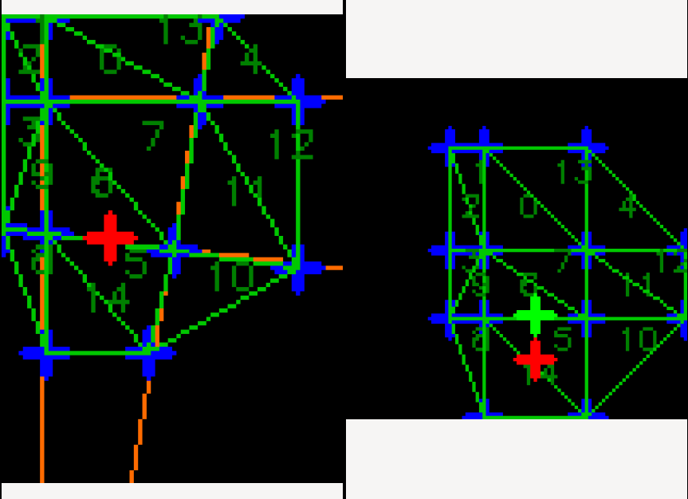

Map Transformer
===============

Ths Map Transformer library provides transformations between two maps which may be close but not quite aligned, with the alignment difference varying across the map.
A point provided in the coordinate space of one map is transformed into the coordinate space of the other, taking account of the non-linear transforms to ensure it is at the equivalent location in the map.

For usage instructions, see [the documentation](https://osrf.github.io/map_transformer/).

