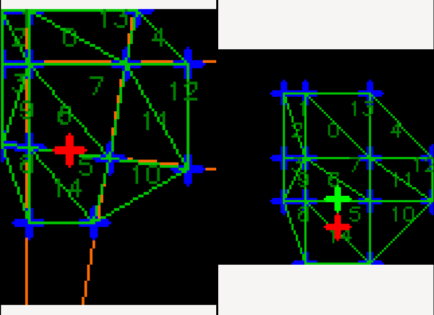

Map Transformer documentation
=============================

.. toctree::
   :maxdepth: 2
   :caption: Contents:


Ths Map Transformer library provides transformations between two maps which may be close but not quite aligned, with the alignment difference varying across the map.
A point provided in the coordinate space of one map is transformed into the coordinate space of the other, taking account of the non-linear transforms to ensure it is at the equivalent location in the map.


Using the library
=================

The main entry point to the Map Transformer library is the `map_transformer::Transformer` class.
This class provides transformations in both directions between a reference map and one other map (termed the "robot map").

An instance of the `Transformer` object must be provided with a YAML document to load.
This can be either passed to the constructor or passed to the `load()` method after construction.
The YAML document contains information about the two maps, and a list of correspondence points.
For a description of the YAML file format, see the next section.

The correspondence points must be provided.
These points describe which points in one map are equivalent to which points in the other map.
In other words, point A in the reference map is the same corner of two walls as point B in the robot map, even though those two points may have significantly different coordinates due to differences in map alignment, skew, etc.
Currently, the correspondence points must be manually calculated and specified by hand.

In general, the more correspondence points you provide, the more accurate the transformation of points between the two maps will be.

Once `Transformer` object instance has been constructed and loaded with map information, you can call the following two member functions to transform points.

- `to_ref()` Transforms a point from the robot map to its equivalent point in the reference map.
- `to_robot()` Transforms a point from the reference map to its equivalent point in the robot map.


YAML file format
================

The YAML file provided as input to the `Transformer` class must comply with the following format.

::

  ref_map:
    name: [The human-readable name of the map, for visualisation purposes]
    image_file: [OPTIONAL; the path to the image file for the map]
    size: [The size, in pixels, of the map as a pair of numbers, e.g. [100, 80]]
    correspondence_points: [A YAML list of pairs of numbers providing the correspondence points for the reference map.]
  robot_map:
    name: [The human-readable name of the map, for visualisation purposes]
    image_file: [OPTIONAL; the path to the image file for the map]
    size: [694, 386]
    correspondence_points: [A YAML list of pairs of numbers providing the correspondence points for the robot map.]

The correspondence point lists must be in the same order.
That is, the first point in one list corresponds to the first point in the other list, and so on.

For example YAML files, see the samples directory.


Sample application
==================

A sample application is provided in the source file `visualiser.cpp`.
This is installed into the `sample` directory, usually located at `<install prefix>/share/map_transformer/sample`.

The sample application displays the reference map and robot map as specified in a YAML file.
It can optionally display the correspondence points, triangulation, and triangle ID numbers.

Launch the sample using a command line similar to the following.

```
./transform_visualiser --map-info-file=/usr/local/share/map_transformer/sample/offset_map.yaml -c -n -t
```

It will produce an output similar to the following screenshot.



Clicking on one of the map images will display:

- the point you clicked on, in red;
- the equivalent point without transformation in the other map image, in red; and
- the equivalent point after transformation in othe other map image, in green.

You can also provide your own YAML files to the sample application and visualise them.


API
===

.. doxygennamespace:: map_transformer
   :outline:
.. doxygenclass:: map_transformer::Transformer
   :members:


* :ref:`genindex`
